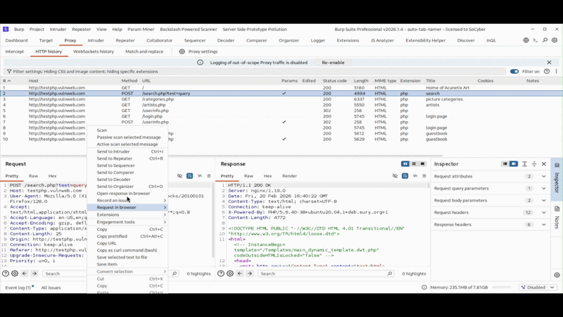

# Burp Auto Tab Namer

#### Always lost in hundreds of Repeater Tabs during Pentesting or Bug Bounty Hunting? 
#### Same here, this is why I created this simple Burp Suite Extenstion which automatically names Repeater tabs based on HTTP method, path, and optional query/host.
#
## 🎬 Demo
> Quick 30-second overview of how it works



## Features

- Send to Repeater with:
  - Path only
  - Path + Query
  - Host + Path
  - Full (Host + Path + Query)
- Works from:
  - Proxy history
  - Request editor

## Usage

Right-click request → Extensions → Auto Tab Namer


## Installing
1. Go to releases
2. Download the jar file
3. Inside Burp Suite -> Extenstions (Installed Tab) -> Add

 
## Build

```bash
git clone https://github.com/ViktorMares/burp-auto-tab-namer
```
```bash
cd burp-auto-tab-namer
```
```bash
mvn clean package
```
